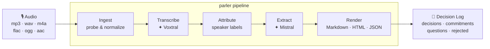

<div align="center">

# parler 🇫🇷

**Turn recorded meetings into structured decision logs.**

[](LICENSE)
[](https://python.org)
[](https://docs.astral.sh/uv/)
[](https://mistral.ai)
[](https://mistral.ai)
[](https://pypi.org/project/parler/)

*Voxtral transcribes. Mistral extracts. parler delivers decisions, commitments, and reports — in French and beyond.*

<table>
  <tr>
    <td align="center" width="50%">
      <br/>
      <sub>Studio — live pipeline run, two-model stage strip, real-time progress</sub>
    </td>
    <td align="center" width="50%">
      <br/>
      <sub>Results — structured decision log with decisions, commitments, and run metadata</sub>
    </td>
  </tr>
  <tr>
    <td align="center" width="50%">
      <br/>
      <sub>Artifacts — project file tree and local cache entry browser</sub>
    </td>
    <td align="center" width="50%">
      <br/>
      <sub>About — capability table, pipeline stage legend, and keyboard shortcuts</sub>
    </td>
  </tr>
</table>

</div>

---

## How it works



Two AI models (by @mistralai) power the pipeline:

| Stage | Model | What it does |
|---|---|---|
| **Transcribe** | Voxtral (`voxtral-mini-latest` / `voxtral-small-latest`) | Multilingual speech-to-text with timestamps |
| **Extract** | Mistral (`mistral-medium-latest` / `mistral-large-latest`) | Structured JSON extraction of decisions, commitments, open questions, and rejected options |

Every run writes a local checkpoint. Re-render or re-extract at any time, no API call required.

---

## Quick start

**1. Install**

```bash
git clone https://github.com/AbdelStark/parler && cd parler
uv sync --locked --group dev
cp .env.example .env          # add MISTRAL_API_KEY=sk-...
```

**2. Validate**

```bash
uv run parler doctor
```

```
✓ API key      MISTRAL_API_KEY found
✓ Config       parler.toml readable
✓ Artifacts    .parler-cache · .parler-runs writable
✓ FFmpeg       ffprobe available
```

**3. Run**

```bash
uv run parler process tests/fixtures/audio/fr_meeting_5min.mp3 \
  --lang fr \
  --participant Pierre \
  --participant Sophie \
  --meeting-date 2026-04-09
```

```
fr_meeting_5min-decisions.md
```

---

## Core usage

### Full pipeline → decision report

```bash
uv run parler process meeting.mp3 \
  --lang fr,en \
  --participant Pierre \
  --participant Alice \
  --output decisions.md
```

- `--lang` — expected language codes; auto-detected if omitted
- `--participant` — known speaker name; repeat for each person
- `--output` — destination path; extension sets the format (`.md` / `.html` / `.json`)
- `--local` — run transcription and extraction with the local Hugging Face `mistralai/Voxtral-Mini-3B-2507` model instead of the hosted Mistral API
- `--verbose` — emit stage-by-stage progress, model names, trace ID, and output summaries to stderr while keeping stdout reserved for the final output path

### Transcription only

```bash
uv run parler transcribe meeting.mp3 --format json --output transcript.json
```

### Full local mode

Install the local inference stack first:

```bash
uv add 'torch>=2.4' 'transformers>=4.57' 'mistral-common[audio]'
```

Then run the pipeline with `--local`:

```bash
uv run parler process meeting.mp3 \
  --lang fr \
  --participant Pierre \
  --participant Sophie \
  --meeting-date 2026-04-09 \
  --local \
  --verbose
```

<table>
  <tr>
    <td width="50%">
      
    </td>
    <td width="50%">
      
    </td>
  </tr>
  <tr>
    <td>
      <sub>Verbose local mode shows the pipeline stages, selected models, and run metadata as they execute.</sub>
    </td>
    <td>
      <sub>The generated markdown report shows the extracted decisions, commitments, questions, and rejections offline.</sub>
    </td>
  </tr>
</table>

`parler` maps `--local` to the open-weights `mistralai/Voxtral-Mini-3B-2507` model for both transcription and transcript-to-JSON extraction. The Hugging Face `mistralai/Voxtral-4B-TTS-2603` repo is a text-to-speech model, not the speech-to-text model used here. Local transcription also depends on the `mistral-common[audio]` stack that Hugging Face's Voxtral processor uses to build transcription prompts.

### Re-render from checkpoint — zero API cost

```bash
uv run parler report --from-state .parler-state.json --format html --output report.html
```

### Interactive TUI cockpit

```bash
uv run parler tui
```

Boots with a synthetic French demo preloaded. Press `Ctrl+R` to run the full pipeline immediately, or pick a real VoxPopuli FR clip from the sidebar.

Some of the sample audio files used by `parler` were generated from clips in the Meta AI Research [VoxPopuli](https://github.com/facebookresearch/voxpopuli) dataset.

---

## What the output looks like

```markdown
# Decision Log

Meeting: 2026-04-09  ·  Languages: fr  ·  Generated by: parler · mistral-medium-latest · v0.1.0

## Decisions (1)

| ID | Summary                                             | Owner  | Timestamp | Confidence |
|----|-----------------------------------------------------|--------|-----------|------------|
| D1 | On part sur le 15 mai pour le lancement. C'est décidé. | Pierre | 03:42 | high |

## Commitments (2)

| ID | Owner  | Action                          | Deadline   | Confidence |
|----|--------|---------------------------------|------------|------------|
| C1 | Sophie | Préparer la démo technique      | 2026-04-12 | high       |
| C2 | Pierre | Envoyer l'invite à l'équipe     | 2026-04-10 | medium     |
```

---

## Configuration

### Environment

| Variable | Description |
|---|---|
| `MISTRAL_API_KEY` | Mistral API key (loaded automatically from `.env`) |
| `PARLER_API_KEY` | Alias — either variable works |

### CLI flags — `parler process`

| Flag | Default | Description |
|---|---|---|
| `--lang` | auto | Language codes — `fr`, `en`, `fr,en` |
| `--participant` | — | Known speaker name (repeat per person) |
| `--format` | `markdown` | Output format: `markdown` · `html` · `json` |
| `--output` | `<stem>-decisions.md` | Output file path |
| `--checkpoint` | `.parler-state.json` | Checkpoint file for resume |
| `--resume` | off | Resume from an existing checkpoint |
| `--transcribe-only` | off | Stop after transcription stage |
| `--no-diarize` | off | Skip speaker attribution |
| `--anonymize-speakers` | off | Replace names in all outputs |
| `--local` | off | Use the local `mistralai/Voxtral-Mini-3B-2507` model for transcription and extraction |
| `-v, --verbose` | off | Log pipeline steps, model names, trace ID, and final artifact summaries to stderr |
| `--cost-estimate` | off | Print estimate and exit — no API calls |

### `parler.toml`

```toml
[transcription]
model    = "voxtral-mini-latest"    # voxtral-small-latest for higher accuracy
languages = ["fr"]

[extraction]
model = "mistral-medium-latest"     # mistral-large-latest for harder meetings

[cache]
directory = ".parler-cache"

[cost]
max_usd = 2.00                      # abort if preflight estimate exceeds this
```

---

## Other commands

```bash
# Estimate spend before any API call
uv run parler process meeting.mp3 --cost-estimate

# Inspect cache
uv run parler cache list
uv run parler cache show <key>
uv run parler cache clear --yes

# Inspect run traces
uv run parler runs list
uv run parler runs show <trace_id>

# Prune stale artifacts
uv run parler cleanup --older-than-days 7
```

### Shell completion

`parler` ships tab-completion snippets for `bash`, `zsh`, and `fish`. Pipe the relevant snippet into your shell config:

```bash
# bash
parler completion bash >> ~/.bash_completion

# zsh
parler completion zsh >> ~/.zshrc

# fish
parler completion fish > ~/.config/fish/completions/parler.fish
```

After reloading your shell, tab-completion works for all `parler` subcommands and options.

---

## Development

```bash
# Fast verification slice
uv run pytest tests/unit tests/integration tests/property -q

# Full quality gate
uv run ruff check parler
uv run mypy parler/
uv build
```

---

## License

[MIT](LICENSE)
